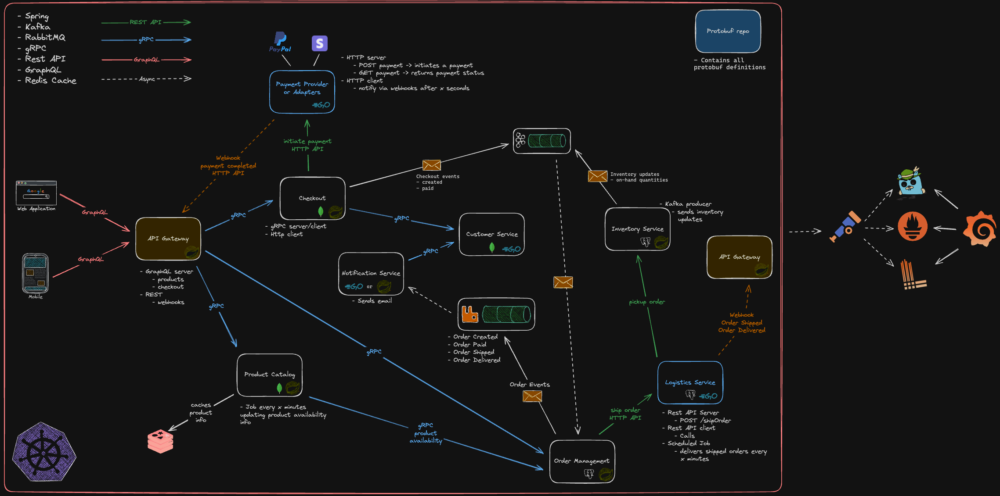

# Disecomm - A distributed ecommerce platform

Disecomm is a distributed ecommerce platform used for educational purposes. It's a project
focused on distributed architecture and microservices.

The idea is to focus on the architecture and the communication between the services, so the
business logic is very simple and not the main focus of the project.

The project also explores observability, monitoring, and logging, so we can have a better
understanding of what's happening inside the system.

## High-level architecture overview

_Node: The architecture is still a work in progress, so it may change in the future._

## Technologies

- **Programming languages**: Java, Go, TypeScript
- **Frameworks**: Spring Boot
- **Databases**: PostgreSQL, MongoDB, Redis
- **Message brokers**: Kafka, RabbitMQ
- **Communication**: REST, gRPC, GraphQL
- **AuthZ/AuthN**: ??
- **Observability**: Prometheus, Loki, Tempo, Grafana
- **Containerization**: Docker, Kubernetes
- **CI/CD**: GitHub Actions

## How to run locally

// todo
