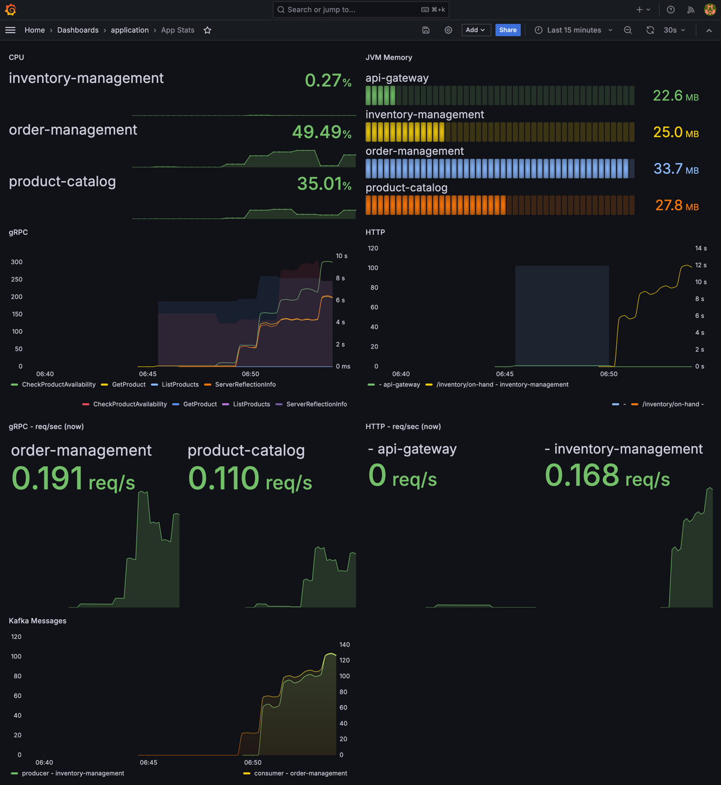
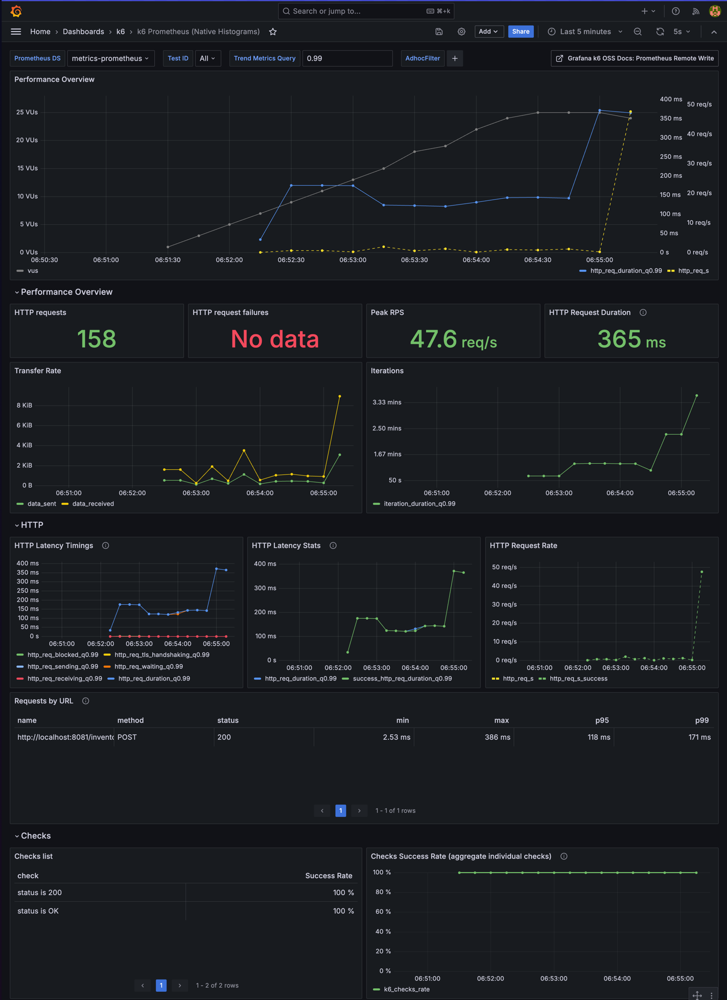
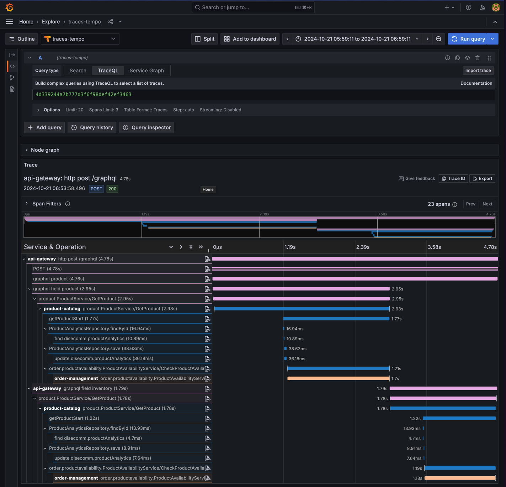

# Disecomm - A distributed ecommerce platform

Disecomm is a distributed ecommerce platform used for educational purposes. It's a project
focused on distributed architecture and microservices.

The idea is to focus on the architecture and the communication between the services, so the
business logic is very simple and not the main focus of the project.

The project also explores observability, monitoring, and logging, so we can have a better
understanding of what's happening inside the system.

> **Note:** _This project is intentionally over-engineered to explore different technologies and
architectures._

## Documentation

- [Events Catalog](https://giovannymassuia.github.io/disecomm)
  - _Still a work in progress_ 

### High-level architecture overview

_Node: The architecture is still a work in progress, so it may change in the future._


## Technologies

- **Programming languages**: Java, Go, TypeScript
- **Frameworks**: Spring Boot
- **Databases**: PostgreSQL, MongoDB, Redis
- **Message brokers**: Kafka, RabbitMQ
- **Communication**: REST, gRPC, GraphQL
- **AuthZ/AuthN**: ??
- **Observability**: Prometheus, Loki, Tempo, Grafana
- **Containerization**: Docker, Kubernetes
- **CI/CD**: GitHub Actions
- **Load testing**: K6

## Running the project locally

To run the project locally, you need to have `Docker` and `Docker Compose` installed on your machine.

> **Note:** _This project has many resources and services, so it may take a while to start everything.
> And it may consume a lot of resources from your machine._

1. 🏗️ Build all the services:
```bash
make build-all
```
> Note: _The first time you run this command, it may take a while to download all the dependencies._

2. 🚀 Start all the resources and services:
```bash
make run-all
```

3. 🌐 Access the resources and services at:
    - Infra
        - **Grafana**: http://localhost:3000
            - _User/Passwd: admin/admin_
            - Look for `App Stats` and `K6 Prometheus` dashboards.
            - Explore `traces`, `logs`, and `metrics`.
        - **Kafka UI**: http://localhost:3001
    - Services
        - **API Gateway**: http://localhost:8083/graphiql
            - _Graphql playground_
        - **Product Catalog**: GRPC localhost:5102
      > Check the docker-compose file to see the ports of the other services.

4. 📈 Run load tests with k6:
> Note: You need to have k6 installed on your machine to run it from local.
- Running k6 load tests will populate the Grafana dashboard with cool metrics.
- The default scenario runs for 15 minutes. Check the [main.js](./local-dev/k6/main.js) file to see the scenario details
```bash
make load-test-local
```
Running from local gives you better progress logs.

But You can also run the load test using docker:
```bash
make load-test-docker
```
> Note: _K6 dashboard will not be populated if you run it from docker (yet 😬)_

5. 🧹 Clean all the resources and services:
```bash
make clean-all
```

#. Others
- Use `make` or `make help` to see all the available commands.




